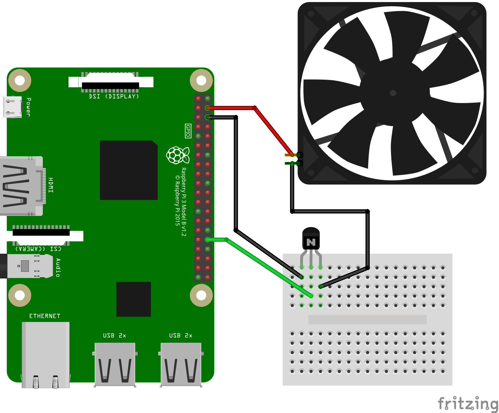

# RPi fan-control
Raspberry Pi fan control 

## Background
 I am running OSMC on two of Raspberry Pi boards. Since I started using [Netflix plugin](https://github.com/asciidisco/plugin.video.netflix), 
 I see a temperature warning icon in the upper right corner from time to time. I am not sure what casued it, but I don't think Netflix plugin is the only reason. So, I decide to add a fan to my Raspberry Pi boards, and refactored the original code which I wrote in 2014.

## Hardware
 We need a fan and a switch to turn it on/off. I picked up NPN trasistor [2SC1815](https://alltransistors.com/transistor.php?transistor=12411) for the switch(basically relay), but I think we can choose any NPN transistor that its emittor-base voltage meets 5V.


## Required Python Packages
 - pyyaml   : `sudo pip install pyyaml` if you don't have
 - RPi.GPIO : `sudo pip install RPi.GPIO` if you don't have

## How to configure
 By default, `fan-control.py` uses BCM12(pin 32) to turn the fan on or off, monitors cpu temperature every 30 seconds and turns the fan on whenever CPU temperature is over 70'C.  However, we can use a different PWM port, threshold temperature and monitoring interval by using configuration file. 

 * On/Off Control example
```
# fan-control.cfg
# GPIO pwm port should be etheir of BCM12, BCM13, or BCM18
#   which are equivalent to pin 32, pin 33, and pin 12
port: 12

# Temperature threshold to turn on fan incase of on/off control
threshold: 80.0

# Temperature monitoring interval
interval: 60
```

 * PWM Control example
```
# fan-control.cfg
# GPIO pwm port should be etheir of BCM12, BCM13, or BCM18
#   which are equivalent to pin 32, pin 33, and pin 12
port: 12

# Temperature monitoring interval
interval: 30

pwm:
  # pwm frequency
  freq: 50.0
  # minimum duty ratio
  duty_min: 70.0
  # mininum temperature to turn fan on
  temp_min: 65.0
  # threshold temperature to set 100% duty ratio.
  temp_max: 85.0
```

## How to use
Copy `fan-control.py` to your Raspberry Pi and run:
```
$ sudo python fan-control.py
```
which uses default configuration.

If you are going to use custom configuration, then 
```
$ sudo python fan-control.py -c <your configuration file with full path>
```

If you want to run `fan-control.py` at startup, the simplest way is adding a line to `/etc/rc.local`.
```
#!/bin/sh -e
#
# rc.local
#
# This script is executed at the end of each multiuser runlevel.
# Make sure that the script will "exit 0" on success or any other
# value on error.
#
# In order to enable or disable this script just change the execution
# bits.
#
# By default this script does nothing.

python /home/osmc/bin/fan-control.py -c /home/osmc/bin/fan-control.cfg

exit 0
```
